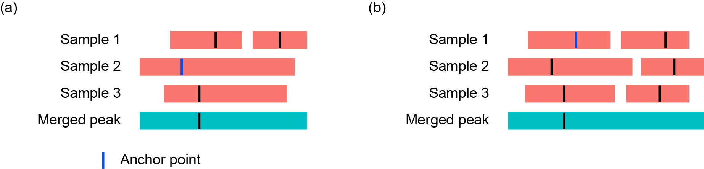

.. MAnorm2_utils documentation master file, created by
   sphinx-quickstart on Tue Aug 21 15:51:22 2018.

==============================
Specification of MAnorm2_utils
==============================

:Author: Shiqi Tu
:Contact: tushiqi@picb.ac.cn
:Version: 1.0.0
:Date: 2018-08-24
:Abstract: :code:`MAnorm2_utils` is designed to coordinate with |MAnorm2|_, an R
  package for differential analysis with ChIP-seq_ signals between two or more
  groups of replicate samples. :code:`MAnorm2_utils` is primarily used for
  processing a set of ChIP-seq samples into a regular table recording the read
  abundances and enrichment states of a list of genomic bins in each of these
  samples.

.. |MAnorm2| replace:: :code:`MAnorm2`
.. _MAnorm2: https://github.com/tushiqi/MAnorm2
.. _ChIP-seq: https://en.wikipedia.org/wiki/ChIP-sequencing

.. Note::

   This document is a fully detailed specification. For a quick experience with
   :code:`MAnorm2_utils`, refer to its `home page`_.

.. _home page: https://github.com/tushiqi/MAnorm2_utils

The primary utility of :code:`MAnorm2_utils` comes from the two scripts bound
with it, named :code:`profile_bins` and :code:`sam2bed`, respectively. This
document focuses on detailing the usage of them.

.. contents:: Contents
   :local:
   :backlinks: entry

.. default-role:: code

.. highlight:: none

Profiling ChIP-seq signals in reference genomic regions
~~~~~~~~~~~~~~~~~~~~~~~~~~~~~~~~~~~~~~~~~~~~~~~~~~~~~~~

Typically, a considerable proportion of the mapped reads of a ChIP-seq sample
are dispersed throughout the genome, while the others cluster together
constituting reads-enriched genomic regions, termed peaks. Peak regions of a
ChIP-seq sample generally represent putative transcription-factor binding sites
or enrichments for a certain histone modification. Refer to MACS_ for more
information about the characteristics of ChIP-seq peaks.

.. _MACS: https://genomebiology.biomedcentral.com/
          articles/10.1186/gb-2008-9-9-r137

:code:`profile_bins` uses pre-defined peaks of a set of ChIP-seq samples to
come up with a list of reference genomic bins (each being enriched for ChIP-seq
signals in at least one of the samples). The program also deduces the read
abundance as well as enrichment status of each of the reference bins in each
sample.

.. Note::

   We recommend `MACS 1.4`_ for identifying peaks for ChIP-seq samples
   associated with narrow genomic regions of reads enrichment (e.g., samples
   for most transcription factors and histone modifications like H3K4me3 and
   H3K27ac). In fact, although having a general applicability,
   :code:`profile_bins` is specifically suited to processing the output files
   generated by MACS 1.4. For histone modifications constituting broad enriched
   domains (e.g., H3K9me3 and H3K27me3), we recommend SICER_ as the peak
   caller. See |here-1|_ for more methods for calling peaks on ChIP-seq data.

.. _MACS 1.4: https://github.com/taoliu/MACS/downloads
.. _SICER: https://academic.oup.com/bioinformatics/article/25/15/1952/212783

.. |here-1| replace:: here
.. _here-1: https://link.springer.com/article/10.1007/s40484-017-0111-8

The following is a sample usage of :code:`profile_bins` of the simplest form:

.. code-block:: bash

   profile_bins --peaks=peak1.bed,peak2.bed \
                --reads=read1.bed,read2.bed \
                --labs=s1,s2 -n example

.. Note::

   :code:`profile_bins` only recognizes BED-formatted_ input files. For read
   alignment results stored in SAM_ files, use first :code:`sam2bed` to
   transform them into BED files before calling :code:`profile_bins` (BED files
   created by :code:`sam2bed` have been specifically designed to suit
   :code:`profile_bins`; see also `Transforming SAM into BED files`_ below).
   For BAM-formatted_ files, refer to Samtools_ for converting them into SAM
   files.

.. _BED-formatted: BED_
.. _BED: http://genome.ucsc.edu/FAQ/FAQformat.html#format1
.. _BAM-formatted: SAM_
.. _BAM: SAM_
.. _SAM Format Specification: SAM_
.. _SAM: https://samtools.github.io/hts-specs/SAMv1.pdf
.. _Samtools: https://www.htslib.org/

If everything goes smoothly, the command above will generate two files, named
``example_profile_bins_log.txt`` and ``example_profile_bins.xls``,
respectively. The former records the full list of parameter settings for
calling :code:`profile_bins`, as well as some summary statistics regarding each
of the supplied ChIP-seq samples. The latter gives the read count and
enrichment status for each deduced reference genomic bin in each sample, and
has a format like the following (data shown here is only for illustration):

.. table:: Example output of :code:`profile_bins`
   :align: right
   :name: Example output

   ======  =======  =======  ============  ============  =============  =============
    chrom    start      end   s1.read_cnt   s2.read_cnt   s1.occupancy   s2.occupancy
   ======  =======  =======  ============  ============  =============  =============
     chr1    28112    29788           115             4              1              0
     chr1   164156   166417           233           194              1              1
     chr1   166417   168417           465           577              1              1
     chr1   168417   169906            15            34              0              1
   ======  =======  =======  ============  ============  =============  =============

To clarify, a genomic bin is "occupied" by a ChIP-seq sample if and only if its
middle point is covered by some peak region of the sample.

:code:`profile_bins` supports a number of parameters for a customized
configuration for deducing reference genomic bins as well as counting the reads
falling in them. Type :code:`profile_bins --help` in the command line for a
complete list of these parameters and a brief description of each of them.

The following subsections classify all the parameters supported by
:code:`profile_bins` into different functions, and provide a detailed
explanation for each of them.

Mandatory inputs
---------------------------------

Read alignment results and peak regions of each of a set of ChIP-seq samples
are required for calling :code:`profile_bins`:

.. table::
   :align: left

   ====================  =======================================================
   `--peaks=<files>`     .. _peaks:

                         BED_ files recording peak regions of each ChIP-seq
                         sample. File names should be separated by a comma (a
                         trailing comma is allowed).

                         The first 3 columns of
                         each BED file are mandatory. The *score* field (i.e.,
                         the 5th column of a BED file) may be optionally used
                         to filter peaks (see |keep-peaks|_ below).
   --------------------  -------------------------------------------------------
   `--reads=<files>`     BED_ files recording read alignments for each ChIP-seq
                         sample. File names should be separated by a comma (a
                         trailing comma is allowed).

                         The first 3 columns of
                         each BED file are mandatory. For single-end reads,
                         the *strand* field (i.e., the 6th column of a BED
                         file) is used for shifting downstream the 5' end of
                         each read, and is assumed to be "+" when the field is
                         not available (see |shiftsize|_ below). For
                         paired-end reads, both the *name* and *strand* fields
                         are required (the 4th and 6th columns of a BED file,
                         respectively; see |paired|_ below).
   ====================  =======================================================

.. |peaks| replace:: `--peaks`

Decorating outputs
---------------------------------

Each call of :code:`profile_bins` generates two files, named
*prefix*\_profile_bins_log.txt and *prefix*\_profile_bins.xls, respectively.
You may specify the common *prefix* of the two file names and the labels of
ChIP-seq samples for creating the header of the latter file:

.. table::
   :align: left

   ===================  =========================================================
   `-n <string>`        Common prefix of the names of output files.

                        Default: NA
   -------------------  ---------------------------------------------------------
   `--labs=<strings>`   Labels of the supplied ChIP-seq samples, separated by a
                        comma (a trailing comma is allowed) and used only for
                        writing the header of an output file.

                        Default: s1,s2,...
   ===================  =========================================================

Deducing reference genomic bins
---------------------------------

:code:`profile_bins` comes up with a set of reference genomic bins by merging
the peak regions from all the provided ChIP-seq samples and dividing up each
*broad* merged peak into consecutive, non-overlapping genomic bins. Several
parameters have been designed for customizing this procedure:

.. table::
   :align: left

   =============================  =================================================
   `--keep-peaks=<int>`           .. _keep-peaks:

                                  The maximum number of peaks to keep for each
                                  ChIP-seq sample. If set, peaks in each peak file
                                  are sorted by their *score* fields (i.e., the
                                  5th column of a BED_ file). These fields are
                                  considered as numeric values, and for each
                                  ChIP-seq sample only the <int> peaks with the
                                  *greatest* scores are retained for the
                                  subsequent usage. By default, all peaks are
                                  used.

                                  Note that this parameter is specifically useful
                                  for processing the BED-formatted peak files
                                  generated by `MACS 1.4`_, where the score field
                                  of each peak represents its statistical
                                  significance and is appropriate for ranking
                                  peaks.
   -----------------------------  -------------------------------------------------
   `--min-peak-gap=<int>`         After filtering peak regions (if |keep-peaks|_
                                  is set), peaks of each ChIP-seq sample that are
                                  within a distance of <int> base pairs to one
                                  another are merged. If |bins|_ is not set, the
                                  merged peaks of each sample will be further
                                  merged across samples (where the parameter is
                                  used again) to come up with a set of reference
                                  genomic bins. The merged peaks of each sample
                                  are also used to determine the enrichment status
                                  of each reference bin in the sample (see
                                  |below-1|_).

                                  This parameter defaults to 150, which is
                                  approximately the length of DNA wrapping a
                                  single nucleosome and, thus, is suited to
                                  the ChIP-seq experiments targeting histone
                                  modifications.
   -----------------------------  -------------------------------------------------
   `--summits=<files>`            .. _summits:

                                  BED_ files recording the summit coordinate of
                                  each peak of each ChIP-seq sample. Only the
                                  first 3 columns of each BED file are used. File
                                  names should be separated by a comma (a trailing
                                  comma is allowed) and match the order of peak
                                  files as specified by |peaks|_. For each pair
                                  of peak and summit files, they may be
                                  corresponded line by line (refer to the outputs
                                  of `MACS 1.4`_ for a concrete example). By
                                  default, the middle point of each peak is taken
                                  as its summit.

                                  After merging peak regions from all the supplied
                                  ChIP-seq samples, :code:`profile_bins` infers
                                  the summit position of each merged peak by using
                                  the summits of individual peaks constituting the
                                  merged one (see `Figure 1`_ for a diagram about
                                  deducing the summit of a merged peak). These
                                  inferred summits will be used as the entry
                                  points for dividing up "broad" merged peaks into
                                  consecutive genomic bins.
   -----------------------------  -------------------------------------------------
   `--typical-bin-size=<int>`     .. _typical-bin-size:

                                  Each merged peak having a size "comparable" to
                                  <int> are directly taken as reference bins. Each
                                  of the others is divided up into consecutive,
                                  non-overlapping genomic bins of <int> base pairs
                                  (except the bins at the edge of merged peaks;
                                  see `Figure 2`_ for a diagram about dividing up
                                  merged peaks).

                                  This parameter defaults to 2000, which suits
                                  well the ChIP-seq samples of histone
                                  modifications. For ChIP-seq samples of
                                  transcription factors, setting the parameter to
                                  1000 is recommended.
   -----------------------------  -------------------------------------------------
   `--bins=<file>`                .. _bins:

                                  An optional BED_ file specifying directly the
                                  set of reference genomic bins. Only the first 3
                                  columns of the file are used. For technical
                                  reasons, each bin mustn't be completely enclosed
                                  by another. Note that the process of merging
                                  peaks across samples is repressed once |bins| is
                                  specified.

                                  Formally, |summits|_, |typical-bin-size|_ and
                                  |fix-bin-size|_ are ignored if |bins| is
                                  specified.
   =============================  =================================================

.. |keep-peaks| replace:: `--keep-peaks`
.. |summits| replace:: `--summits`
.. |typical-bin-size| replace:: `--typical-bin-size`
.. |bins| replace:: `--bins`

   ..

   **Figure 1. Deducing the summit of a merged peak.** Boxes represent original
   peak regions from different ChIP-seq samples and the resulting merged
   peak. Ticks within boxes mark summits of the original peaks as well as the
   inferred summit of the merged peak.

   For each merged peak,
   the algorithm takes summits of the involved original peaks, and selects
   one of them as the *anchor point*. Then, for each ChIP-seq sample involved,
   it identifies the summit that is closest to the anchor. Finally, the
   *median* one of these identified summits is considered as the summit of the
   merged peak. There are two scenarios for deriving the anchor point:

   (a) There exist ChIP-seq samples that contribute only one peak to the merged
       peak. In this case, the algorithm takes the summits
       *that come from those samples* (e.g., sample 2 and 3 in the diagram),
       and selects the median one as the anchor point.

   (b) Each ChIP-seq sample involved contributes at least two peaks to the
       merged peak. In this case, the algorithm takes summits of *all* the
       involved peaks, and selects the median one as the anchor point.

         consecutive genomic bins
   :align: left
   :figwidth: image
   :name: Figure 2

   ..

   **Figure 2. Default mode for dividing up merged peaks into consecutive
   genomic bins.** Boxes represent a merged peak and the associated genomic
   bins. Ticks within boxes mark the *inferred* summit (see `Figure 1`_) of
   the merged peak as well as centers of bins.

   For each merged peak,
   the algorithm divides it up into consecutive genomic bins by first placing
   the bin whose center aligns with the inferred summit of the merged peak.
   It then extends a sequence of equal-sized, non-overlapping
   genomic bins towards both directions until the whole merged peak is covered.
   An edge bin is retained and trimmed to the corresponding edge of the merged
   peak if its center is covered by the merged peak (see the left edge bin);
   an edge bin is trimmed and absorbed into its predecessor otherwise (see the
   right one). See also |fix-bin-size|_ for an alternative mode for
   processing edge bins.

.. |below-1| replace:: below
.. _below-1:

After determining reference genomic bins, :code:`profile_bins` assigns an
"occupancy" indicator to each of the bins in each sample (see also the table of
`Example output`_ shown above), to assess whether the bin is enriched for
ChIP-seq signals in the sample. Formally put it,
a reference bin has an occupancy indicator of 1 in a certain ChIP-seq sample
if and only if the bin's middle point falls within some peak region belonging
to the sample.

Note also that these occupancy indicators are essential to the normalization
algorithm implemented in |MAnorm2|_.

Counting reads falling within reference genomic bins
----------------------------------------------------

:code:`profile_bins` next counts, for each ChIP-seq sample, the reads that fall
within each reference genomic bin. It handles both single-end and paired-end
reads, and has made specific efforts to take the full advantage of paired-end
samples. Note that each read (or read pair), before being assigned to reference
genomic bins, is converted into a genomic locus representing the imputed middle
point of the underlying DNA fragment associated with the read (or read pair).
Thus, each read (or read pair) would not be assigned simultaneously to two
non-overlapping reference bins.

There are several parameters designed for this procedure:

.. table::
   :align: left

   =========================  ====================================================
   `--shiftsize=<int>`        .. _shiftsize:

                              By default, reads are treated as single-end, and
                              the 5' end of each of them will be shifted <int>
                              base pairs downstream to reach the putative center
                              of the underlying DNA fragment. Note that the
                              strand of each read is assumed to be "+" when the
                              corresponding field (i.e., the 6th column of a BED_
                              file) is not available.

                              This parameter defaults to 100, and may be set to
                              half of the practical DNA fragment size selected in
                              the library preparation process.
   -------------------------  ----------------------------------------------------
   `--paired`                 .. _paired:

                              If set, reads are considered as paired-end. In this
                              case, middle point of the underlying DNA fragment
                              associated with each read pair could be accurately
                              inferred. Note that two reads from the same
                              ChIP-seq sample are considered as a read pair only
                              if they have *exactly the same* name (i.e., the 4th
                              column of a BED_ file; see also the
                              |Note below-1|_). Besides, a read pair is
                              valid only if the two reads are mapped to the
                              different strands of the same chromatin. Unpaired
                              reads and invalid read pairs, if any, will be
                              ignored with a warning message.

                              |shiftsize|_ is ignored when |paired| is set.
   -------------------------  ----------------------------------------------------
   `--keep-dup=all/<int>`     .. _keep-dup:

                              This parameter controls the program's behavior
                              regarding duplicate reads (or read pairs)
                              potentially resulting from PCR amplification. For
                              single-end reads, two reads are considered as
                              duplicates if their 5' ends are mapped to the same
                              genomic locus; for paired-end reads, two read pairs
                              are considered as duplicates if their implied DNA
                              fragments occupy the same genomic interval.

                              By default (i.e., `--keep-dup=all`), all reads (or
                              read pairs) are preserved for counting; if
                              |keep-dup| is set to an integer, at most <int>
                              reads (or read pairs) of a set of duplicates from
                              the same sample are retained for counting. Note
                              that the output log file records, for each sample,
                              the ratio of reads (or read pairs) that are removed
                              due to |keep-dup|.
   -------------------------  ----------------------------------------------------
   `--method=byBin/byRead`    The algorithm to be used for counting reads. Must
                              be either "byBin" or "byRead". In rare cases can
                              using "byRead" be faster than using "byBin".

                              Default: byBin
   =========================  ====================================================

.. |shiftsize| replace:: `--shiftsize`
.. |paired| replace:: `--paired`
.. |keep-dup| replace:: `--keep-dup`

.. |Note below-1| replace:: Note below
.. _Note below-1:

.. Note::

   :code:`profile_bins` identifies read pairs from a BED_ file by pairing the
   read names (i.e., the 4th column of the BED file). Formally, two reads are
   treated as a pair if and only if they have *exactly the same* name. This
   manner of pairing reads, however, may conflict with some well-known routines
   for generating BED files from files of other formats. For example, the
   |bamtobed|_ utility provided by the Bedtools_ suite could convert sequence
   alignments in BAM_ format into BED records. However, if |bamtobed| is used
   to transform paired-end alignments, name field of each of the resulting BED
   records will be the corresponding query template name (i.e., the 1st
   mandatory field of the corresponding BAM record) with a *suffix* of /1 or /2
   appended. Roughly speaking, these suffixes are used to indicate whether each
   read is the 1st or 2nd mate of the read pair it belongs to, and they don't
   agree with the rule of recognizing read pairs implemented in
   :code:`profile_bins`.

   On this account, the recommended strategy for converting BAM into BED files
   is to utilize the Samtools_ in collaboration with our :code:`sam2bed` script
   (see also `Transforming SAM into BED files`_ below). For example, you may
   exploit the following command to achieve the task:

   .. code-block:: bash

      samtools view sample.bam | sam2bed -o sample.bed

.. |bamtobed| replace:: :code:`bamtobed`
.. _bamtobed: https://bedtools.readthedocs.io/en/latest/content/tools/bamtobed.html
.. _Bedtools: https://bedtools.readthedocs.io/en/latest/

Duplicate reads (or read pairs) could strongly bias the testing results of the
following differential analysis. Therefore, for both paired-end reads and
deep-sequencing single-end reads (e.g., >25 million), we strongly recommend
removing potential duplicates by setting the |keep-dup|_ to 1, which could
significantly enhance the specificity of various downstream analyses. We also
suggest applying the paired-end sequencing technology to the practical design
of ChIP-seq experiments, which, compared with single-end sequencing,
dramatically improves the accuracy of identifying real PCR duplicates rather
than those reads (or read pairs) that are mapped to the same genomic location
by chance.

.. Caution::

   The mechanism by which :code:`profile_bins` recognizes duplicates is highly
   dependent on the mapping positions of 5' ends of reads. In practice,
   however, 5' ends of reads are often trimmed in the pre-processing stage for,
   e.g., removing low-sequencing-quality bases from the alignments with the
   reference genome. On this account, we strongly emphasize that the length of
   bases trimmed from 5' ends must remain *constant* for all reads from the
   same sample, presuming that you want to exploit the duplicates recognition
   mechanism implemented in :code:`profile_bins`.

Miscellaneous
---------------------------------

Several other parameters have been devised to add to the functionality of
:code:`profile_bins` as well as to make it more accessible to users:

.. table::
   :align: left

   ======================  ======================================================
   `--fix-bin-size`        .. _fix-bin-size:

                           If set, an alternative mode for dividing up merged
                           peaks into reference genomic bins will be utilized,
                           and all the resulting reference bins will be of the
                           same size (i.e., the |typical-bin-size|_). Note
                           that reference bins may overlap with each other in
                           this mode (see `Figure 3`_ for a detailed
                           illustration of this alternative mode).

                           This parameter is ignored when |bins|_ is
                           specified.
   ----------------------  ------------------------------------------------------
   `--filter=<file>`       An optional BED_ file specifying a list of genomic
                           regions to be filtered out from the following
                           analyses. Only the first 3 columns of the file are
                           used. Any reference bin that overlaps with some
                           genomic region belonging to the list is suppressed
                           from the output table. Note that filtering is
                           performed at the last stage of the program, and
                           summary statistics written to the output log file
                           (e.g., for each ChIP-seq sample the ratio of reads or
                           read pairs that fall within reference bins) are
                           calculated with respect to the whole set of reference
                           bins.

                           ChIP-seq experiments often produce artifact signals
                           in certain regions of the genome. In practice, we
                           recommend filtering out a
                           `black list of genomic regions`_ that tend to have
                           anomalously excessive reads mapping prior to the
                           downstream differential analysis. Such black lists
                           for various genome assemblies of multiple species
                           could be downloaded |here-2|_.
   ----------------------  ------------------------------------------------------
   `--parameters=<file>`   .. _parameters:

                           A configuration file specifying the parameters
                           *in addition to* those provided on the command line.
                           |parameters| itself can only be defined on the
                           command line. Each line in <file> defines a
                           parameter, with a format (for both short and long
                           parameters) of "name=value" (with no spaces between
                           them), or "name" alone. In either case, the leading
                           hyphen(s) should *not* be included in the "name".

                           The following is an example configuration file::

                             peaks=peak1.bed,peak2.bed
                             reads=read1.bed,read2.bed
                             n=example
                             labs=s1,s2
                             summits=summit1.bed,summit2.bed
                             paired
                             keep-dup=1
                             filter=blackList.bed

   ----------------------  ------------------------------------------------------
   `-v/--version`          Print the version of the program and exit.
   ----------------------  ------------------------------------------------------
   `-h/--help`             Print a help message and exit.
   ======================  ======================================================

.. |fix-bin-size| replace:: `--fix-bin-size`
.. |parameters| replace:: `--parameters`

         consecutive genomic bins
   :align: left
   :figwidth: image
   :name: Figure 3

   ..

   **Figure 3. Alternative mode for dividing up merged peaks into consecutive
   genomic bins.** Boxes represent a merged peak and the associated genomic
   bins. Ticks within boxes mark the *inferred* summit (see `Figure 1`_) of
   the merged peak as well as centers of bins.

   The only difference between this alternative mode and the default mode (see
   `Figure 2`_) is in the manner of dealing with edge bins. In this mode, an
   edge bin is retained (and *not* trimmed) if its center is covered by the
   merged peak (see the left edge bin); an edge bin is discarded otherwise (see
   the right one). Notably, edge bins from adjacent merged peaks may
   overlap with each other in this mode.

.. _black list of genomic regions: https://sites.google.com/site/anshulkundaje/
                                   projects/blacklists

.. |here-2| replace:: here
.. _here-2: http://mitra.stanford.edu/kundaje/akundaje/release/blacklists/

.. Tip::

   Better store all the parameter settings in a configuration file and assign
   it to |parameters|_ when invoking :code:`profile_bins`, especially in the
   cases where a large number of samples are involved.

.. Note::

   Syntax of the configuration file for calling :code:`profile_bins` is a bit
   different from that used in some other applications (e.g., in the
   |setup.cfg|_ for distributing and installing Python packages). Particularly,
   "pure" options (i.e., those without arguments) in our configuration file are
   specified by ``name`` alone *rather than* ``name=1``.

.. |setup.cfg| replace:: :code:`setup.cfg`
.. _setup.cfg: https://setuptools.readthedocs.io/en/latest/setuptools.html
               #configuring-setup-using-setup-cfg-files

Transforming SAM into BED files
~~~~~~~~~~~~~~~~~~~~~~~~~~~~~~~

:code:`sam2bed` converts SAM_ into BED_ files.
It is designed to coordinate with :code:`profile_bins`, since the
latter only accepts BED-formatted input files. The simplest form of calling
:code:`sam2bed` is as follows:

.. code-block:: bash

   sam2bed -i File.sam -o File.bed

The program will read from the standard input stream if `-i` is not
specified.

For a complete list of parameters supported by :code:`sam2bed`, type
:code:`sam2bed --help` in the command line, and you'll see the following::

  Description: This program converts a standard SAM file to a BED file.

  Usage: sam2bed -i File.sam -o File.bed [options]

  Input/Output:
  -i <file>            Input SAM file. Default: standard input stream.
  -o <file>            Output BED file name. Mandatory.

  Options:
  --min-qual=<int>     Any mapping records with a mapping quality below
                       <int> are ignored. Default: 0

  --retain-secondary   If set, secondary alignments are retained in the
                       output. Default: OFF

  --retain-supplementary
                       If set, supplementary alignments are retained in
                       the output. Default: OFF

  --suppress-extension
                       If set, the alignment match section in reference
                       sequence is output for each alignment record. By
                       default, the section is extended to reach the two
                       end points of the read, which is suited to the
                       following identification of duplicate reads, if
                       needed.

  -v/--version         Print the version information and exit.

  -h/--help            Print this help message and exit.

  Note: The query template name and mapping quality are taken as the
  name and score field in the output BED file, respectively.

We expect all the parameters shown above but `--suppress-extension` to be
easy to understand. See `Figure 4`_ for a detailed explanation of
`--suppress-extension`.

.. figure:: images/extend_alignment_section.png
   :alt: Extend the alignment match sections in reference sequence to
         reach the end points of reads
   :align: left
   :figwidth: image
   :name: Figure 4

   ..

   **Figure 4. Extend the alignment match sections in reference sequence to
   reach the end points of reads.** Consistent with the
   *0-based coordinate system*, which is the coordinate system used by BED_
   files, here the reference sequence starts with a coordinate of 0, and the
   intervals mentioned below are all left closed and right open. Note that SAM_
   files utilize a different coordinate system.

   Two reads are shown in the diagram, and their 5' ends are both associated
   with *soft clippings* due to a low sequencing quality (see the
   `SAM Format Specification`_ for more information about CIGAR string).
   The alignment matches for these two reads start from 8 and 10, respectively,
   which correspond to the POS fields of their SAM alignment records.
   If `--suppress-extension` is set, the interval *exactly* wrapping the
   alignment matches of each read is written to the output BED file, which is
   ``[8, 16)`` and ``[10, 16)`` for read 1 and 2, respectively. Thus, the two
   reads will not be treated as duplicates by :code:`profile_bins`, since their
   5' end positions are not the same (see also the |keep-dup|_ parameter of
   :code:`profile_bins`). In the default mode, the alignment intervals are
   extended to reach the end points of reads, and ``[7, 16)`` will be output
   for both of the two reads. In this case, if |keep-dup| is set to 1 when
   calling :code:`profile_bins`, only one of the two reads will be retained for
   the counting procedure (see also the section of
   `Counting reads falling within reference genomic bins`_).

.. Tip::

   In the vast majority of cases, the default setting of most of the parameters
   supported by :code:`sam2bed` should be used.
   The only parameter that may be customized in
   practice is the `--min-qual`, which controls the program's behavior
   regarding filtering out the alignment records with a low mapping quality.

